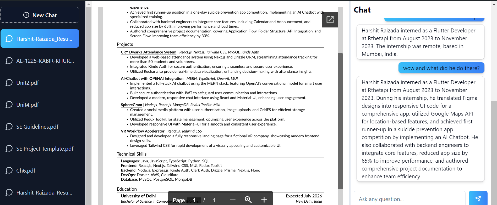

---
# 📄 **Summarize My PDF** 🤖
---

## 🎥 **Video Preview**




---

_(Currently Under Construction — So Close Yet So Far!)_ 🚧

_This project is like your favorite dish in the oven – it smells great, but you can’t eat it just yet! 🍕 While it’s still baking, feel free to peek behind the scenes._ 😎

**Update:** This is the hardest project I have built up until now. Unfortunately, Stripe has now switched their policy, and I can't create an account unless I get an invite. Therefore, I won’t be deploying this SaaS. However, you can still tinker with it in local development. Please make sure to leave a star if you like it! ⭐

---

Welcome to **Summarize My PDF AI**! This project allows users to upload a PDF, splits the document into multiple embeddings, stores them in Pinecone DB, and uses those embeddings in a chatbot to provide accurate and contextual answers, with chats stored in PostgreSQL.

### 🎯 **Features**

- 📂 **Drag-and-Drop PDF Upload**
- 🧠 **PDF Content Summarization**
- 🌐 **Pinecone DB for Embeddings**
- 💬 **AI Chatbot with Contextual Understanding**
- 🗃️ **Chat History Stored in PostgreSQL**
- ☁️ **AWS S3 for File Storage**

---

### 🚀 **Getting Started**

Follow the steps below to get the project up and running on your local machine.

#### 1. **Clone the Repository**

```bash
git clone https://github.com/dankgarlic1/SummarizeMyPDF.git
cd summarize-my-pdf-ai
```

#### 2. **Install Dependencies**

Make sure you have Node.js installed, then install the project dependencies:

```bash
npm install
```

#### 3. **Set Up Environment Variables**

Create a `.env` file in the root directory and add the necessary environment variables. **Do not share your API keys publicly!** Make sure your `.env` file contains something like this:

```bash
# Clerk API Keys
NEXT_PUBLIC_CLERK_PUBLISHABLE_KEY=<your_clerk_publishable_key>
CLERK_SECRET_KEY=<your_clerk_secret_key>

# Database
DATABASE_URL=<your_database_url>

# AWS S3
NEXT_PUBLIC_S3_ACCESS_KEY_ID=<your_s3_access_key>
NEXT_PUBLIC_S3_SECRET_ACCESS_KEY=<your_s3_secret_access_key>
NEXT_PUBLIC_S3_BUCKET_NAME=<your_s3_bucket_name>

# Pinecone DB
PINECONE_API_KEY=<your_pinecone_api_key>

# OpenAI
OPENAI_API_KEY=<your_openai_api_key>
```

#### 4. **Run the Development Server**

Start the development server with:

```bash
npm run dev
```

Your app will be running at [http://localhost:3000](http://localhost:3000) 🚀.

---

### 🛠️ **Technologies Used**

- **Next.js** - Server-side rendering and static site generation 🌐
- **PostgreSQL** - Robust database for storing chat history 🗄️
- **Pinecone** - Vector database for efficient embeddings 📊
- **OpenAI** - AI models for summarization and contextual chat 🤖
- **AWS S3** - File storage for uploaded PDFs ☁️
- **React Dropzone** - Smooth drag-and-drop PDF upload 📂
- **Drizzle ORM** - Simple, yet powerful ORM for database operations 🛠️

---

### 🔥 **Running Database Migrations**

To push database changes to PostgreSQL, run:

```bash
npm run db:push
```

To access the database studio:

```bash
npm run db:studio
```

---

### 🎨 **Styling**

TailwindCSS is used for quick and scalable UI development. All components are highly customizable via props.

---

### 🧑‍💻 **Local Development Tips**

- For managing API keys securely, always use environment variables.
- Use **react-hot-toast** for displaying notifications and loading states.
- For custom embeddings and PDF content processing, **@pinecone-database/doc-splitter** handles PDF chunking efficiently.

---

### ⚠️ **Important Note**

In the `FileUpload` component, I hardcoded my email (`raizadaharshit2004@gmail.com`) to allow unlimited PDF sessions while other users have a limit of two. To ensure fair use and limit resources, please comment out or remove the part of the code where my email is hardcoded:

```jsx
const isSpecialUser = userEmail === "raizadaharshit2004@gmail.com";
```

Feel free to explore the project, but don’t get too attached to it just yet – it’s almost there! 🚀

---
